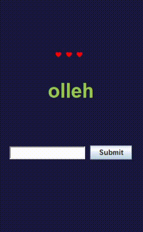

# Scrambler Game

## Todo

### Version 1
- [x] Add button to quit the game
- [x] Make a GAME OVER screen
- [X] Palindromes should still come out scrambled
- [X] Display new challenge if you win
- [x] Make a VICTORY screen
- [x] Add a restart button
- [x] Gradiant button background color
- [x] Get a logo for the health display
- [X] Rework victory screen looks
- [X] Rework defeat screen looks
- [X] Make restart button reset game
- [X] Submit answer by pressing ENTER
- [X] Fix horizontal stack
- [X] Game Over screens
  - [X] FLAWLESS VICTORY
    - [X] Total time
    - [X] Word that took you the longest time to solve (max)
    - [X] Word that took you the shortest time to solve (min)
  - [X] VICTORY
    - [X] Total time
    - [X] Word that took you the longest time to solve (max)
      - [X] Does not reset timer
    - [X] Word that took you the shortest time to solve (min)
    - [X] HP lost per incorrect guess
  - [X] LOSE
    - [X] Total time
    - [X] Word that took you the longest time to solve (max)
    - [X] Word that took you the shortest time to solve (min)
    - [X] HP lost per incorrect guess
  - [X] EPIC LOSS
    - [X] Total time
    - [X] Present user with word that defeated them
- [ ] Add more challenges
- [ ] Get new GIF for the preview
- [ ] Get a logo for the app
- [ ] Improve the look of the various game screens

### Version 2
- [ ] Add difficulty levels
- [ ] Optimize word scramble algorithm
- [ ] Different color for button when armed
